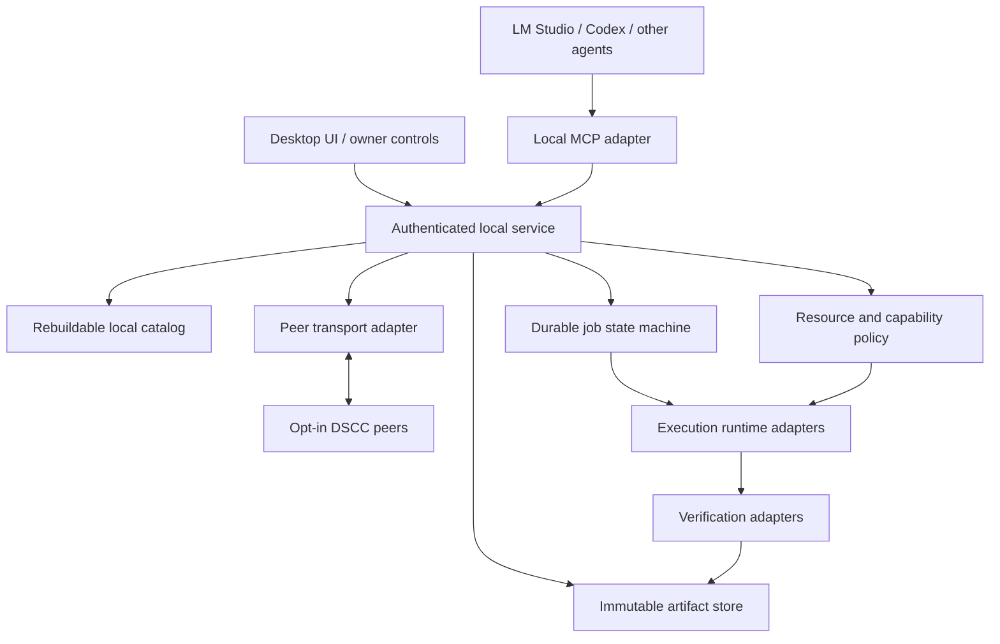
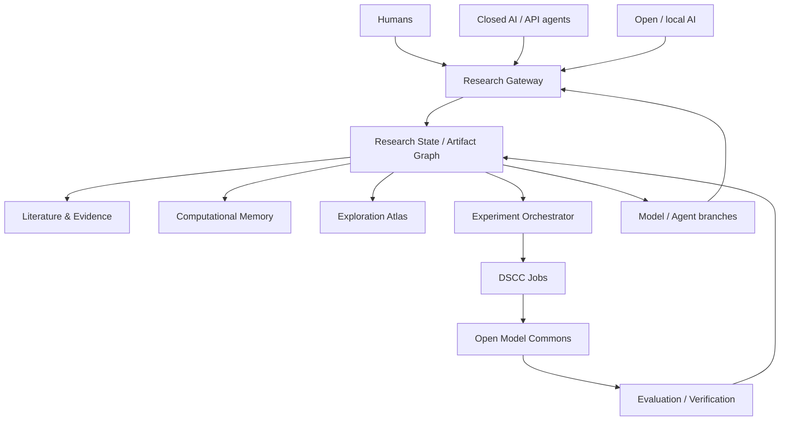

# DSCC Desktop 設計書

## 1. 製品の目的

一人の利用者がDSCC Desktopをインストールし、LM StudioやCodexなどのAIアプリから、保存した研究記録を参照し、道具を使い、許可された計算を依頼できる。複数の利用者が参加した後は、同じ仕組みで研究資産と計算時間を交換できる。モデルが入れ替わっても、データ、実験条件、結果、作成した道具、未解決課題を引き継ぐ。最終的には、この継承層の上で世界中のクローズAI、オープンAI、人間が同じAI研究projectを共同で進める Distributed AI Research Laboratory を構成する。

原論文の設計原則を継承する。ここで追加するのは、デスクトップ製品のプロセス構成、実装順、具体的なインターフェース、共同開発手順である。自律的な研究サービスやモデル改良を将来載せられる余地は保つ。最初のコードに未検証の自動学習・遠隔実行を混ぜず、接続契約から育てる。

## 2. 完成形の構成

UIとAI接続は同じアプリケーションサービスを使う。権限変更、公開、資源割当の最終処理を画面側だけに置かず、サービス層で強制する。参加者が停止したときは、その参加者の仕事と共有を止める。中央の必須サービスを置かず、ブートストラップとリレーは複数の運営者が置き換えられる補助役にする。

## 3. プロセスと実装言語

初期のCore/API/MCPはPython 3.11+で作る。科学計算との接続、データ形式の検証、既存AI開発環境への導入を優先する。CoreにGUIや特定LLMを埋め込まない。初期コードの入口はCLIとstdio MCPである。

完成形では、一つのユーザー用node serviceが永続状態と鍵を所有し、UIとMCP adapterはローカルIPC経由で接続する。複数MCPプロセスが同じSQLiteを開く今回の構成は、同一OSユーザー内の試作形であり、強い権限分離ではない。別OSユーザーのworker service、認証済みIPC、OS keychainへ移行する作業を独立課題にした。

ネイティブUIはTauri等の薄いshellを候補とするが、採用と配布署名方式はADRで決める。P2PはKubo/libp2pをsidecarまたはadapterとして組み込み、科学runtimeはWASI/OCIを使う。Pythonだけでネットワーク・sandbox・GPU driverを再実装しない。

## 4. 共有フォルダーの意味

「公開する研究フォルダー」と「他人の成果を保管するキャッシュ」は別にする。ユーザーがフォルダーを選んでも、選んだ直後に全内容を公開しない。対象ファイル、ライセンス、個人情報、共有範囲、依存ファイルの一覧を確認し、公開するsnapshotを作る。以後の編集も新しいsnapshotであり、未承認のファイルを自動追加しない。

秘密鍵、認証情報、ホームディレクトリ、他アプリの記憶ファイルは既定で共有対象外。削除は自分のコピーの削除とネットワークからの完全消去を区別する。公開した平文が他者に複製された後の完全消去は保証しない。機密研究は別の暗号化・鍵配布プロファイルを使う。

## 5. データと整合性

原論文と同様、不変artifact、可変catalog、共同編集状態、job state、科学的claim、貢献receiptを別にする。CIDは内容の同一性を検査し、署名は鍵の所有者が記録を署名したことを示す。いずれも内容の科学的正しさは保証しない。

今回のseedでは小さい研究記録をRFC 8785互換の制限JSONプロファイルで正規化し、Ed25519署名を含むenvelopeをCIDv1/raw/sha2-256で識別する。浮動小数点のメタデータは10進文字列にする。原論文の包括的Artifact schemaと互換であるとは宣言せず、seed専用versionを付け、変換課題を用意する。大規模配列、モデル重み、OCI imageは最終的にchunked binary/CARへの参照になる。

catalogは再構築可能な索引であり、原本ではない。親CIDは成果の派生関係を記述する。親リンクの存在、署名者、データハッシュと、結論が支持されるかは別々に評価する。検索は初期のキーワード一致から、全文検索、意味検索、複数indexer統合へ発展させる。

## 6. 参加と通信

LANではmDNSと手動peer交換を使い、インターネットではlibp2pの識別・暗号化接続・接続支援を利用する。NAT越えに失敗する回線もあるためrelayの運営者、帯域上限、費用、切断動作を明記する。「アプリを入れれば必ず直接通信できる」とはしない。

誰でもアプリを取得できることと、誰のコードでも実行することは別である。公開資産の取得、検索への登録、計算受付、検証者としての信頼は独立した許可にする。各ownerが許可したpeer、runtime、tool digest、予算に従って動く。共有メモリ内の命令文は権限にならない。

## 7. ジョブ実行

ジョブは入力CID、tool digest、パラメータ、希望計算機能、資源上限、期限、出力schema、検証クラスを宣言する。実行者はローカルpolicyで受付し、leaseと一意の試行IDを割り当てる。完了・失敗・cancel・lease切れを永続化し、同じジョブが重複実行され得る前提で結果確定を冪等にする。一般の分散系に対し無条件のexactly-onceは約束しない。

今回の実装はローカルの既知の整数集計関数だけを実行する。第三者コード、shell、URL、コンテナimageの指定は受け付けない。この関数実行をsandbox実証と呼ばない。次段階のWASI runnerで、実際のCPU時間、メモリ、ファイル、通信の制限とキャンセルを確認する。

## 8. GPU共有と分散学習

GPUは機種、VRAM容量、driver、runtime、利用時間、電力方針を含む資源として広告する。一般的なGeForceで「VRAMの半分」「GPU使用率50%」を強い隔離保証として実現できるとは仮定しない。最初は専用GPUまたは時間枠単位の割当を基本にし、対応する機種だけpartition機能を利用する。推論用GPUと共有workerの競合を画面に表示する。

離れた24GB GPUが4枚集まっても、一台の96GB GPUにはならない。独立した実験ジョブ、同一拠点の高速接続が必要なjob、通信を抑えたWAN向け学習を別classにする。分散学習には学習アルゴリズムの対応、帯域、障害回復、データ・更新の検証が必要であり、単純なGPU枚数では割り振らない。

GPU sandboxはCPU sandboxより追加条件が多い。device passthroughやdriver共有は攻撃面を増やす。公開GPU workerを有効化する前に、機種別のisolation matrix、破壊的jobのテスト、ownerによる停止、checkpoint回収、温度・電力の観測を受入条件にする。

## 9. 科学ツールと探索技法

Tool、Workflow、WorldSnapshot、ExperimentRun、MemoryCapsuleを同じ不変資産基盤で関連付ける。科学シミュレータや探索戦略を保存するときは、入力・出力契約、依存環境、ライセンス、測定条件、実行費用を記録する。探索履歴の再生で過去に未観測の結果が確定するわけではないため、観測済みの証拠と代理評価を区別する。

新しい探索アルゴリズムやカーネル最適化器もTool/Workflowとして載せられるようにする。登録されたという理由だけで実行権限を与えない。レビュー済みdigestとownerの許可を照合する。モデル設計・学習・評価は、同意された研究予算内の明示的なjob graphとして扱う。

## 10. 検証と貢献記録

V0は決定的再実行、V1は数値許容差と不変量、V2は確率的再現、V3は証拠と独立レビュー、V4は機密計算の保証範囲を扱う。今回のverifyはハッシュ・署名・親存在の検査であり、V0の独立科学検証ではない。demoの同一マシン内再実行も独立した運営者による検証とは呼ばない。

貢献receiptは利用時間・機種・実行内容・検証結果を記録し、現金や移転可能なcredit残高と区別する。受領証だけでは二重使用、結託、Sybil、換金、配分は解決しない。経済層は別ADRと会計・法的検討を通す。初期版に換金や資金運用を実装しない。

## 11. UIで表示すること

ホームには自分の研究資産、現在の計算、利用上限、接続先、エラーを表示する。共有設定には公開snapshotとcache容量、worker設定にはCPU/GPUと実行可能runtime、承認画面には入力データ・予算・外部通信・公開範囲を表示する。P2P接続数がゼロでも研究ノートの保存と参照は使える。未実装の設定を動くsliderとして出さず、対応状況と実測値を分ける。

## 12. 開発と検証の方針

完成形の自由度を保ち、最初に確かめる接続だけを実装する。後段の機能を「比較しやすいから」制限しない。GPU性能やAI能力の主張は、実測のコスト・速度・結果と対応させる。CIでは正当性・境界・互換性を検証し、性能優位や家庭ネットワークでの到達性は別実験として記録する。採用した設計はADR、未確定の設計はproposal、実行済みの確認はvalidation reportに分けて残す。

## 13. Open Model Commons foundation

長期の [Distributed Open Model Commons](proposals/DISTRIBUTED_OPEN_MODEL_COMMONS.ja.md) に向けて、モデル自体も研究資産として扱う。ただし巨大weightを既存の1 MiB署名JSONへ押し込まない。署名付きModel manifestが、別のcontent-addressed large blockを参照する二層構造にする。

現行実装はローカルblock store、Model/ComputeCapability/TrainingRun profile、block availability検査、非実行のinference placement plannerまでである。plannerの出力はjobでもcapability tokenでもなく、実行権限を持たない。

完成形では、peer transportがlarge blockのchunked transferとrepairを担い、runtime adapterがowner-approved model jobを隔離実行し、schedulerが実測capabilityとnetwork条件から配置を決め、verifierが推論・学習の結果を別々に検査する。

世界規模pre-trainingでは、遠隔GPUを一台の共有VRAMとして扱わない。local island内の高速parallelismと、island間のlow-communication optimizationを分離する。既知の分散学習研究を再利用し、consumer GPUのchurn、heterogeneity、malicious update、dataset provenance、checkpoint forkをDSCC固有の検証対象にする。

Open Model Commonsを導入しても、node ownerの停止権、resource budget、private data境界、実行承認を弱めない。model research agentが新しいcheckpointを提案できても、それだけでrelease権限や追加resource権限を取得しない。

## 14. Distributed AI Research Laboratory — 最終アーキテクチャ

DSCCの最終目標は [Distributed AI Research Laboratory](proposals/DISTRIBUTED_AI_RESEARCH_LAB.ja.md) である。Open Model Commonsはmodel/compute層であり、その上にresearch orchestration層を置く。

### 14.1 参加者を同一modelへ統一しない

closed AIはAPI/tool adapter経由のresearcherとして参加できる。open/local AIはresearcherにも研究対象にもなれる。人間は問題設定、仮説、実験、評価、再現、compute提供を同じArtifact graphへ追加できる。

研究handoffの単位はconversation historyではなくversioned ArtifactとResearch Stateである。異なるproviderやmodelへ交代しても、input CID、既知研究、未解決問題、実験結果、失敗、評価、次の候補を辿れるようにする。

### 14.2 研究loop

research orchestratorは、問いを受けたらまず既知研究を確認し、一次資料からknown resultとunresolved questionを分離する。実験は未解決部分へ割り当てる。

設計では目的に対して最も強くなり得る本命案を先に作り、比較用の簡略版はそこから派生させる。ablationの都合で本命architectureや研究workflowを固定しない。

長期loopは次を永続化する。

- research goals
- literature state
- hypotheses
- experiment queue
- model / agent branches
- compute requirements
- evaluation results
- failed approaches
- replication status
- unresolved conflicts
- open questions

### 14.3 closed modelの再現性

closed modelのweightや内部状態を要求しない。provider、model identifier、snapshot/versionが取得できる場合はその識別子、tool contract、input Artifact CIDs、output Artifact CIDを記録する。

provider側でmodelが更新された場合、同一runを完全再現できない可能性をResearch Stateに保持する。open/local model runの完全再現性と同一classとして扱わない。

### 14.4 AI研究者自身も研究対象にする

research agentのarchitecture、memory、retrieval、tools、model、training方法もmodel lineageと同様にversion管理できるようにする。

改良されたresearch agentは過去Artifactを継承して次cycleへ参加できる。研究能力の評価には、既知研究の再発明回避、未解決点抽出、experiment validity、failure recovery、cross-agent handoffなどを含める。

T012がresearch contractとcross-model handoffの最初の実装laneを担当する。分散実行はT011およびruntime/P2P/verification層と接続する。
